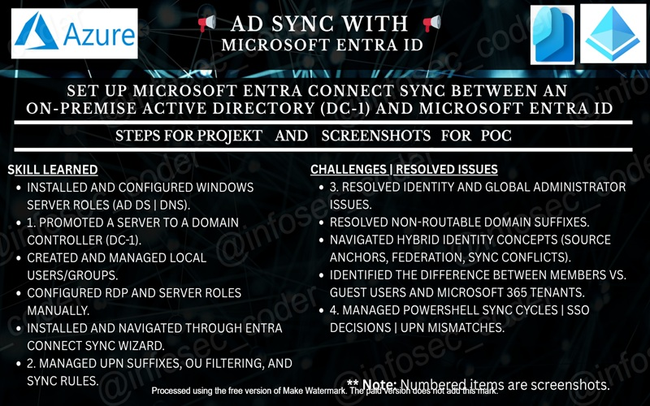
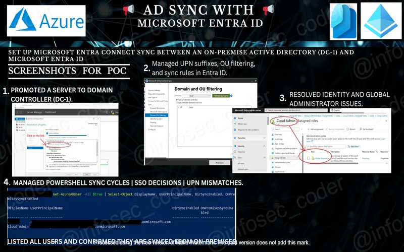

# 🧭 AD-Entra-Connect-Sync-Entra-ID

🔁 *Synchronize On-Premises Identity + Migrate File Shares to Microsoft Cloud Services with Zero Trust Controls*

Part I 

  Part II 

---

## 📌 Project Description

This Proof of Concept (PoC) demonstrates a **secure hybrid identity and file migration workflow**, simulating a real-world transition from **on-premises Active Directory and file shares** to **Microsoft Entra ID** and **SharePoint Online**.

The project focuses on **identity synchronization, access validation, and cloud-native collaboration**, while incorporating **Conditional Access**, **Microsoft Purview**, and **Log Analytics** concepts to reflect **Zero Trust security principles**.

Designed as a hands-on lab to showcase **hybrid identity architecture**, **enterprise IAM fundamentals**, and **secure Microsoft 365 migrations**—making it well-suited for recruiters evaluating admin-level cloud and security experience.

---

## 🚀 Key Steps Simulated in This Project

- 🖥️ **Deploy Windows Server VM (`DC-1`)** in Azure  
- 🛂 **Install & configure Active Directory Domain Services (AD DS)**  
- 🔗 **Install and configure Microsoft Entra Connect** for hybrid identity sync  
- 📁 **Simulate an on-prem file server** using shared folders on `DC-1`  
- 📤 **Migrate files** from NTFS shares to SharePoint Online document libraries  
- 🛡️ **Apply Conditional Access policies** to validate identity-aware controls  
- 🧪 **Test synchronized user access** and cloud sign-in behavior  
- 🧹 **Clean up Azure and Microsoft 365 resources** post-lab  

---

## 🧱 Core Infrastructure (Simulated)

| Component               | Description                                                                 |
|------------------------|-----------------------------------------------------------------------------|
| 🖥️ Azure VM (DC-1)      | Windows Server hosting Active Directory Domain Services                     |
| 🛂 Active Directory     | Simulated on-premises identity provider                                     |
| 🔗 Entra Connect        | Syncs identities from on-prem AD to Microsoft Entra ID                      |
| 👥 Microsoft Entra ID   | Cloud-based identity and access management                                  |
| 🗂️ SharePoint Online    | Target platform for migrated file shares                                    |
| 🧠 Microsoft Purview    | Auditing, data classification, and activity tracking                        |
| 🔐 Conditional Access   | Identity- and location-based access enforcement                              |
| 📊 Log Analytics        | Centralized visibility into sign-ins and access activity                    |

---

## 🧪 Testing & Validation

### ✅ Summary Table (Mit Ikons)

| 🔢 Step | Goal                                | Tool / Location            |
|--------|-------------------------------------|----------------------------|
| 1️⃣     | Sign in as synced AD user           | `portal.office.com`        |
| 2️⃣     | Access SharePoint Online            | Microsoft 365 App Launcher|
| 3️⃣     | Open migrated documents             | SharePoint Document Library|
| 4️⃣     | Validate Entra-based authentication | Entra ID → Sign-in Logs   |
| 5️⃣     | Simulate blocked access             | VPN / excluded location   |

---

### 🧠 Identity Behavior Confirmations

| 🔍 Verification Item                         | 📌 Status | 🧾 Evidence |
|--------------------------------------------|-----------|-------------|
| Identity synced from on-prem AD             | ✅        | User visible in Entra ID |
| Cloud-issued authentication token           | ✅        | Entra ID listed as issuer |
| No legacy authentication prompts            | ✅        | Browser-based login only |
| Sign-in logged and auditable                | ✅        | Entra Sign-in Logs |
| SharePoint access governed by identity      | ✅        | Conditional Access applied |

---

## 🛡️ Conditional Access & Zero Trust Controls

### 🔐 What Was Implemented

- ✅ **Policy Type**: Conditional Access (Block Untrusted Locations)  
- 👤 **Target**: Test user synced from on-prem AD  
- 🌍 **Condition**: Named locations vs. non-trusted IP ranges  
- ⛔ **Access Decision**: Block access when conditions not met  
- 🧪 **Validation**: Successful login allowed / denied based on location  

---

### 🎯 Security & Career Value

| Benefit | Description |
|-------|-------------|
| 🛡️ | Demonstrates Zero Trust enforcement using identity context |
| 🧠 | Shows understanding of hybrid IAM design patterns |
| 🛠️ | Hands-on Conditional Access configuration & testing |
| 🌍 | Transferable identity concepts across AWS / GCP federated IAM |
| 💼 | Relevant to cloud security, IAM, and DevSecOps roles |

---

## 🧹 Clean-Up Checklist

- 🧼 Remove test users and groups from Microsoft Entra ID  
- 💻 Delete Azure VM (`DC-1`) and associated networking resources  
- 🗑️ Remove migrated files and SharePoint test site  
- 📜 Disable or remove Conditional Access policies (if persistent tenant)  
- 📉 Stop Log Analytics ingestion and remove diagnostic settings  

---

## 🎯 Learning Outcomes

- 🔁 Implemented **hybrid identity synchronization** using Entra Connect  
- 🛂 Gained hands-on experience with **Active Directory + Entra ID integration**  
- 📁 Executed a **file server migration** to SharePoint Online  
- 🛡️ Designed and validated **Zero Trust access controls**  
- 📊 Audited identity and access activity using **Entra Logs & Log Analytics**  

---

*This project reflects real-world hybrid identity and migration scenarios commonly encountered in enterprise, regulated, and security-focused environments.*

