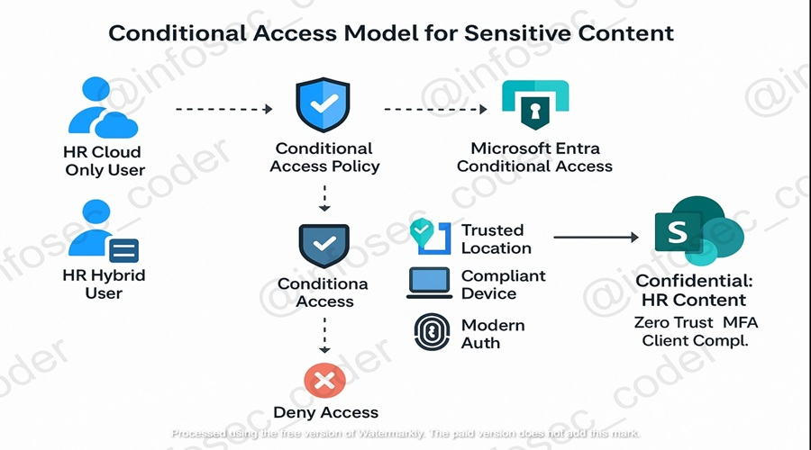

# 🧭 Hybrid Identity x SharePoint Migration Lab

🔁 *Synchronize On-Premises Identity + Migrate File Shares to Microsoft Cloud Services with Zero Trust Controls*

---

## 📌 Project Description

This hands-on lab simulates a **secure hybrid migration** from **on-premises Active Directory and File Server** to **Microsoft Entra ID** and **SharePoint Online**. You’ll also apply **Microsoft Purview**, **Conditional Access**, and **Log Analytics** to enforce access control, simulate Zero Trust, and validate real-world cloud behavior.

Perfect for proving admin-level hybrid identity, security design, and data governance experience.

---

## 🚀 Key Steps Simulated in This Project

- 🖥️ **Deploy Windows Server 2022 VM** in Azure as `DC-1`.  
- 🛂 **Install & configure Active Directory Domain Services** to simulate a real-world domain.  
- 🔗 **Set up Microsoft Entra Connect** to sync identities from on-prem AD to Microsoft Entra ID.  
- 📁 **Simulate a File Server** on `DC-1` by creating and sharing folders.  
- 📤 **Migrate files** to SharePoint Online using structured, label-ready folders.  
- 🛡️ **Enable Conditional Access Policies** for user + device + location control.  
- 🧪 **Validate secure access** by testing cloud sign-ins and Purview label behavior.  
- 🧹 **Clean up all resources** to avoid incurring cost after testing.  

   

---

## 🧱 Core Infrastructure (Simulated)

| Component               | Description                                                              |
|------------------------|--------------------------------------------------------------------------|
| 🖥️ Azure VM (DC-1)      | Hosts Active Directory Domain Services (AD DS)                            |
| 🛂 Active Directory     | Simulates an on-premises identity provider                               |
| 🔗 Entra Connect        | Synchronizes on-prem AD users to Microsoft Entra ID                      |
| 👥 Microsoft Entra ID   | Cloud identity + access management platform (formerly Azure AD)          |
| 🗂️ SharePoint Online    | Serves as the modern destination for migrated file shares                |
| 🧠 Microsoft Purview    | Enables auditing, labeling, and data classification                      |
| 🔐 Conditional Access   | Applies Zero Trust enforcement based on identity, location, and device   |
| 📊 Log Analytics        | Visualizes access logs and label telemetry across Microsoft services     |

---

## 🧪 Testing & Validation

### ✅ Summary Table (Mit Ikons)

| 🔢 Step | Goal                                | Tool                      |
|--------|-------------------------------------|---------------------------|
| 1️⃣     | Login as `testuser1`                | `portal.office.com`       |
| 2️⃣     | Open SharePoint Online              | M365 App Launcher         |
| 3️⃣     | Access labeled document             | Document Library          |
| 4️⃣     | Confirm identity is cloud-native    | Entra > Sign-in Logs      |
| 5️⃣     | Trigger blocked access scenario     | VPN or excluded location  |

### 🧠 Identity Behavior Confirmations

| 🔍 What to Confirm                         | 📌 Status | 🧾 Evidence Provided                                     |
|------------------------------------------|-----------|----------------------------------------------------------|
| Entra-issued token (cloud-only)          | ✅        | Token issuer = Entra ID, Auth method = "Previously satisfied" |
| No legacy auth prompts                   | ✅        | Used InPrivate session, no domain pop-ups                |
| Login is audited in Entra Sign-in Logs   | ✅        | Validated sign-in via M365 > Microsoft Entra             |
| Labels trigger expected access controls  | ✅        | Audited in Purview Activity Explorer                     |

---

## 🛡️ Conditional Access & Risk-Based Access (Step 7)

### 🔐 What Was Implemented

- ✅ **Policy Name**: Block Untrusted Locations  
- 👤 **Targeted User**: `testuser1`  
- 🌍 **Condition**: Exclude *Named Locations*  
- ⛔ **Access Decision**: Block login from all others  
- 🔁 **Simulation**: Validated using VPN / foreign IP  

### 🎯 Value of This Step

| 🔐 | Real-World Zero Trust: enforce identity, location, and risk-based access     |
|------|------------------------------------------------------------------------|
| 🛠️ | Practical Conditional Access design + rollback simulation                  |
| 🌍 | Cross-cloud security skill: applies to AWS/GCP federated identity setups   |
| 💼 | In-demand knowledge for regulated industries & security roles              |
| 🚀 | Progress toward DevSecOps / Cloud Architect roles                          |

---

## 🧹 Clean-Up Checklist

- 🧼 Remove test users/groups from Microsoft Entra ID  
- 💻 Delete Azure VM (DC-1) and remove network resources  
- 🗑️ Delete files/folders from SharePoint Online  
- 📜 Remove Conditional Access policy if persistent tenant is in use  
- 📉 Stop Log Analytics and purge diagnostic settings  

---

## 🎯 Learning Outcomes

- 🔁 Demonstrated real-world **hybrid identity integration** with Entra ID & AD DS  
- 📁 Executed **file migration & permission mapping** from on-prem to SharePoint  
- 🧠 Applied **Microsoft Purview** for classification, labeling, and audit trails  
- 🛡️ Designed and simulated **Zero Trust policies** using Conditional Access  
- 📊 Visualized and validated activity using **Log Analytics & Entra Logs**  

---

> 💬 *Would you like this version exported as a PDF, shared to LinkedIn, or added as a portfolio case study? Let me know, I’ll package it up perfectly for recruiters.*

- 📁 Apply **secure file handling and access governance** using bucket policies and endpoints.
- ⚙️ Practice using **DevSecOps pipelines** with Infrastructure-as-Code and observability.
- 🌐 Explore real-world **multi-cloud readiness** and **compliance-driven design**.

