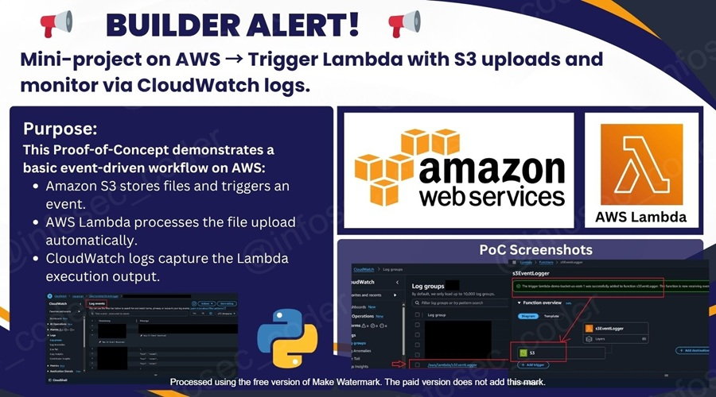

# 🧭 AWS Event-Driven Mini Project

🔁 *Trigger Lambda with S3 uploads and monitor via CloudWatch Logs*

---

## 📌 Project Description

This Proof of Concept (PoC) demonstrates a **basic event-driven workflow** in AWS:

- 🪣 **Amazon S3** stores files and triggers events.  
- 🧠 **AWS Lambda** processes new file uploads automatically.  
- 📊 **CloudWatch Logs** captures Lambda execution output.

Designed to highlight practical skills in **serverless compute**, **permissions management**, and **monitoring**, ideal for **DVA-C02 exam domains**: Compute, Storage, Permissions, and Monitoring & Logging.

---

## 🚀 Key Steps Simulated in This Project

- 🪣 **Create an S3 bucket** to store test files.  
- 🧠 **Create a Lambda function** to process uploaded files.  
- 🔐 **Attach an IAM role** granting Lambda S3 read + CloudWatch write permissions.  
- 🔔 **Add S3 trigger** to Lambda for automatic execution on file upload.  
- 📤 **Upload a test file** to trigger Lambda.  
- 📊 **Inspect logs in CloudWatch** to validate event processing.  
- 🧹 **Clean up resources** to avoid charges.

  

---

## 🧱 Core Infrastructure

| Component                | Description                                                              |
|--------------------------|--------------------------------------------------------------------------|
| 🪣 Amazon S3 Bucket       | Stores uploaded files and triggers Lambda events                         |
| 🧠 AWS Lambda Function    | Processes S3 events and prints metadata to CloudWatch Logs               |
| 🔐 IAM Role               | Provides least-privilege permissions for Lambda (S3 read + CloudWatch write) |
| 📊 CloudWatch Logs        | Monitors Lambda execution and event details                               |
| 🌐 AWS Management Console | Web interface to create, configure, and test all resources               |

---

## 🧪 Testing & Validation

### ✅ Summary Table (Mit Ikons)

| 🔢 Step | Goal                                | Tool                  |
|--------|-------------------------------------|----------------------|
| 1️⃣     | Create S3 bucket                    | AWS Console / S3     |
| 2️⃣     | Create Lambda function              | AWS Console / Lambda |
| 3️⃣     | Attach IAM role                     | AWS Console / IAM    |
| 4️⃣     | Add S3 trigger to Lambda            | Lambda → Triggers    |
| 5️⃣     | Upload test file                    | S3 Console           |
| 6️⃣     | Verify Lambda execution & logs      | CloudWatch Logs      |

### 🧠 Event Behavior Confirmations

| 🔍 What to Confirm                       | 📌 Status | 🧾 Evidence Provided                      |
|----------------------------------------|-----------|-----------------------------------------|
| Lambda triggered by S3 upload           | ✅        | Logs in CloudWatch show event details    |
| IAM permissions allow S3 read           | ✅        | No “Access Denied” errors                |
| Logs captured in CloudWatch             | ✅        | Lambda output visible in `/aws/lambda/...` |
| Event JSON structure correct            | ✅        | Printed event shows bucket + object key |

---

## 🛡️ Permissions & Security (IAM Role)

### 🔐 What Was Implemented

- ✅ **Role Name**: LambdaS3ExecutionRole  
- 👤 **Assigned to Lambda**  
- 🧾 **Policy**: S3 read + CloudWatch logs write  
- 🔁 **Simulation**: Upload multiple files to test event-driven execution  

### 🎯 Value of This Step

| 🔐 | Real-World Cloud Security & DevOps Skills |
|------|------------------------------------------|
| 🛠️ | Hands-on IAM role creation & least-privilege setup |
| 🌍 | Understanding cross-service permissions (S3 → Lambda → CloudWatch) |
| 🚀 | Event-driven architecture knowledge for serverless apps |
| 💼 | Skill directly relevant to DVA-C02 exam and AWS developer roles |

---

## 🧹 Clean-Up Checklist

- 🧼 Delete Lambda function  
- 🪣 Delete S3 bucket and uploaded files  
- 🔐 Delete IAM role  
- 📊 Purge CloudWatch logs if persistent  

---

## 🎯 Learning Outcomes

- 🔁 Built a **serverless event-driven workflow** with S3 → Lambda → CloudWatch  
- 🧠 Applied **IAM roles and least privilege** for secure function execution  
- 📊 Monitored execution using **CloudWatch Logs**  
- 🚀 Reinforced **core DVA-C02 domains**: compute, storage, permissions, monitoring  
- 🧹 Practiced **clean-up best practices** to minimize cost

