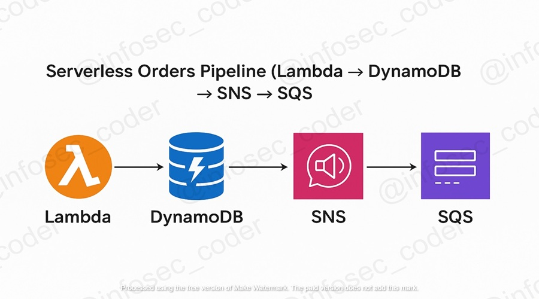

# 📦 Serverless Orders Pipeline  (Lambda → DynamoDB → SNS → SQS)

🔁 *Process Orders Securely in a Serverless Event-Driven Architecture on AWS*

---

## 📌 Project Description

This hands-on project builds upon a previous Lambda–DynamoDB–SNS workflow by integrating **Amazon SQS** to demonstrate message **decoupling** and **asynchronous processing**.  

It models a realistic **e-commerce order pipeline**, where each order is stored, validated, and then queued for downstream processing — all within AWS’s **serverless ecosystem**.

**Core AWS Services Used:**
- **AWS Lambda** – processes incoming orders  
- **DynamoDB** – stores persistent order records  
- **SNS** – publishes alerts for high-value orders  
- **SQS** – queues messages for asynchronous processing  
- **CloudWatch** – monitors logs and metrics  
- **IAM** – controls permissions using least privilege  

---

## 🚀 Key Steps Simulated in This Project

- 💾 &nbsp;&nbsp;**Create DynamoDB Table** (`OrdersTable`) to store order data.  
- 🧠 &nbsp;&nbsp;**Deploy Lambda Function** to process incoming order JSON events.  
- 🔔 &nbsp;&nbsp;**Create SNS Topic** (`HighValueOrderTopic`) for notifications.  
- 📬 &nbsp;&nbsp;**Create SQS Queue** (`HighValueQueue`) to receive SNS messages.  
- 🔗 &nbsp;&nbsp;**Subscribe SQS Queue to SNS Topic** for automatic message delivery.  
- 🔐 &nbsp;&nbsp;**Attach IAM Policies** to Lambda role for DynamoDB, SNS, and SQS actions.  
- 🧪 &nbsp;&nbsp;**Test Lambda Execution** with sample high-value order events.  
- 🔍 &nbsp;&nbsp;**Verify End-to-End Flow**: Lambda → DynamoDB → SNS → SQS → CloudWatch.  

---

## ✅ Project Goals

- 💾 &nbsp;&nbsp;Persist order data in DynamoDB for tracking and reliability.  
- 🔔 &nbsp;&nbsp;Notify on orders above a defined threshold using SNS.  
- 📬 &nbsp;&nbsp;Queue SNS notifications into SQS for later consumption.  
- 🔐 &nbsp;&nbsp;Apply **least privilege** IAM policies for Lambda execution.  
- 📊 &nbsp;&nbsp;Monitor success metrics and errors in CloudWatch Logs.  

---

## 🔧 What I Accomplished

- 💾 &nbsp;&nbsp;**Created DynamoDB Table (`OrdersTable`)**  
  Partition key: `OrderId` (String) | Billing mode: On-demand.  

- 🔔 &nbsp;&nbsp;**Created SNS Topic (`HighValueOrderTopic`)**  
  Publishes alerts for orders exceeding `$300`.  

- 📬 &nbsp;&nbsp;**Created SQS Queue (`HighValueQueue`)**  
  Serves as a decoupled buffer for SNS messages.  

- 🔗 &nbsp;&nbsp;**Subscribed SQS Queue to SNS Topic**  
  Confirmed subscription under *SNS → Subscriptions* tab.  

- 🔐 &nbsp;&nbsp;**Created IAM Role (`ProcessOrderFunction-role`)**  
  Inline policy allows:
  ``json
  {
    "Version": "2012-10-17",
    "Statement": [
      { "Effect": "Allow", "Action": ["dynamodb:PutItem"], "Resource": "arn:aws:dynamodb:us-east-1:<account-id>:table/OrdersTable" },
      { "Effect": "Allow", "Action": ["sns:Publish"], "Resource": "arn:aws:sns:us-east-1:<account-id>:HighValueOrderTopic" },
      { "Effect": "Allow", "Action": ["sqs:SendMessage"], "Resource": "arn:aws:sqs:us-east-1:<account-id>:HighValueQueue" }
    ]
  }

