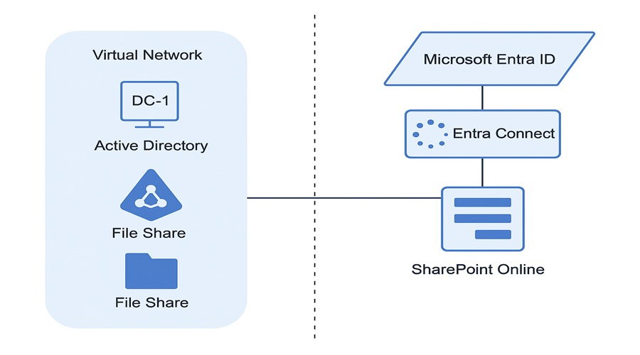

# 📦 On-Prem AD to Entra ID x SharePoint Migration

🔁 *Migrate Users & File Shares Securely from Legacy Infrastructure to Microsoft 365 Cloud Services*

---

## 📌 Project Description

This mini-project demonstrates a smooth and secure migration workflow from **on-premises Active Directory and File Servers** to **Entra ID (formerly Azure AD)** and **SharePoint Online**. It is designed for organizations transitioning to cloud-based identity and collaboration platforms.

---

## 🚀 Key Steps Simulated in This Project

- 👤 &nbsp;&nbsp;**Create a user** in Entra ID (Azure AD) to simulate on-prem user identity.  
- 👥 &nbsp;&nbsp;**Add the user** to an Azure AD Security Group.  
- 🔐 &nbsp;&nbsp;**Assign a built-in role** (e.g., Reader) to the group to define access permissions.  
- 📤 &nbsp;&nbsp;**Migrate file shares** from on-premises File Server to SharePoint Online Document Library.  
- 🌐 &nbsp;&nbsp;**Use Entra ID** for cloud-based authentication and authorization.  
- ✅ &nbsp;&nbsp;**Validate user access** by logging in and confirming visibility and access to files.

  

---

## 🧱 Core Infrastructure (Simulated)

| Component                | Description                                             |
|--------------------------|---------------------------------------------------------|
| 🖥️ VM (DC-1)              | Windows Server VM to install and configure AD DS         |
| 🛂 Active Directory       | Simulates on-premises identity provider                 |
| 🔗 Entra Connect          | Tool for syncing on-prem AD identities to Entra ID      |
| 🧑‍🤝‍🧑 Entra ID (Azure AD) | Cloud-based identity and access management              |
| 🗂️ SharePoint Online      | Cloud file collaboration and document management system |

---

## 🧪 Testing & Validation

- 🔐 Login with the synced user account into Microsoft 365.
- 📂 Access the SharePoint Document Library.
- ✅ Verify the user has proper read/write permissions based on assigned group role.

---

## 🧹 Clean-Up Checklist

- 🧼 Remove test users and groups from Entra ID.
- 💻 Delete or deallocate the Windows Server VM (DC-1).
- 🗑️ Clear uploaded files from SharePoint Online Document Library.

---

## 🎯 Learning Outcomes

- 🧠 Understand hybrid identity models using Entra ID and AD DS.
- ⚙️ Practice directory synchronization with Entra Connect.
- 📁 Migrate and manage file access via SharePoint.
- 🛡️ Reinforce access control using roles and groups.

---

## 📝 Notes

- This is a **Proof-of-Concept (PoC)** setup. For production, you’ll need network hardening, secure synchronization, conditional access, and compliance configuration.
- Make sure your M365 trial includes SharePoint and Entra ID P1 or P2 for advanced testing.

---

## 📂 Recommended Add-Ons (Optional)

- 🔐 Conditional Access Policies (Entra ID)
- 📊 Microsoft Defender for Identity (for threat detection)
- 🧭 Azure Monitor or Log Analytics for auditing

---

