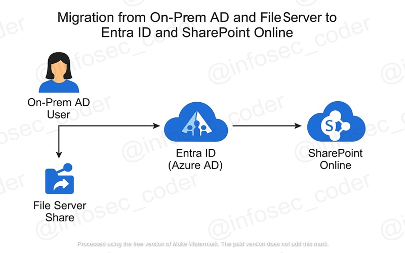

# 📦 On-Prem AD to Entra ID x SharePoint Migration

🔁 *Migrate Users & File Shares Securely from Legacy Infrastructure to Microsoft 365 Cloud Services*

---

## 📌 Project Description

This mini-project demonstrates a smooth and secure migration workflow from **on-premises Active Directory and File Servers** to **Entra ID (formerly Azure AD)** and **SharePoint Online**. It is designed for organizations transitioning to cloud-based identity and collaboration platforms.

---

## 🚀 Key Steps Simulated in This Project

- 👤 &nbsp;&nbsp;**Create a user** in Entra ID (Azure AD) to simulate on-prem user identity.  
- 👥 &nbsp;&nbsp;**Add the user** to an Azure AD Security Group.  
- 🔐 &nbsp;&nbsp;**Assign a built-in role** (e.g., Reader) to the group to define access permissions.  
- 📤 &nbsp;&nbsp;**Migrate file shares** from on-premises File Server to SharePoint Online Document Library.  
- 🌐 &nbsp;&nbsp;**Use Entra ID** for cloud-based authentication and authorization.  
- ✅ &nbsp;&nbsp;**Validate user access** by logging in and confirming visibility and access to files.  

---

## ✅ Project Goals

- 👤 &nbsp;&nbsp;Simulate on-prem Active Directory user migration to Entra ID (Azure AD).  
- 👥 &nbsp;&nbsp;Create a security group and manage role-based access through group assignments.  
- 🔐 &nbsp;&nbsp;Assign a built-in Reader role to control user permissions.  
- 📂 &nbsp;&nbsp;Simulate file server migration by assigning access to SharePoint Document Libraries.  
- 🧭 &nbsp;&nbsp;Navigate Microsoft 365 environment using Entra and SharePoint online services.  

---

## 🔧 What I Accomplished

- 🧑‍💻 &nbsp;&nbsp;Created a cloud-based Entra ID user  
      Simulated an identity migrating from on-prem AD into Microsoft Entra ID for modern access control.

- 👥 &nbsp;&nbsp;Created a Security Group in Azure AD  
      Organized users into manageable groups for streamlined role assignments and access policies.

- 🔐 &nbsp;&nbsp;Assigned the Reader Role to the Group  
      Provided scoped, read-only access to relevant resources through RBAC (role-based access control).

- 📤 &nbsp;&nbsp;Simulated File Server to SharePoint Migration  
      Assigned permissions to SharePoint Online resources, mimicking file share replacement.

- ✅ &nbsp;&nbsp;Tested End-to-End Access  
      Logged in as the new user to validate access controls and confirm proper role functionality.

---

## 💡 Key Learnings & Outcomes

- ☁️ &nbsp;&nbsp;Learned how to replicate hybrid identity management using Microsoft Entra ID.  
- 🔐 &nbsp;&nbsp;Gained experience assigning RBAC roles to Azure AD groups and validating secure access.  
- 🔄 &nbsp;&nbsp;Understood how cloud services like SharePoint integrate with Azure AD identities.  
- ⚙️ &nbsp;&nbsp;Improved familiarity with Microsoft 365 tools and their administrative workflows.  

