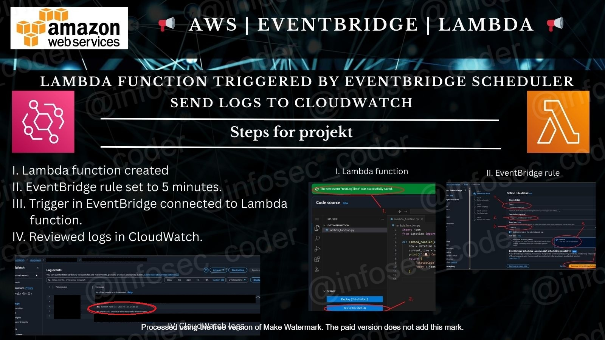

## 📢 SNS x Lambda: Event-Triggered Email Notification Project 

## ✉️ Send Email Alerts in Real-Time Using AWS SNS and Lambda Functions

## 📌 Project Description
This mini-project focused on building a lightweight event-driven architecture that sends automated email notifications using AWS Simple Notification Service (SNS) and AWS Lambda. It demonstrates how to connect cloud services to send alerts in response to events, showcasing a common pattern in serverless and decoupled system design.

