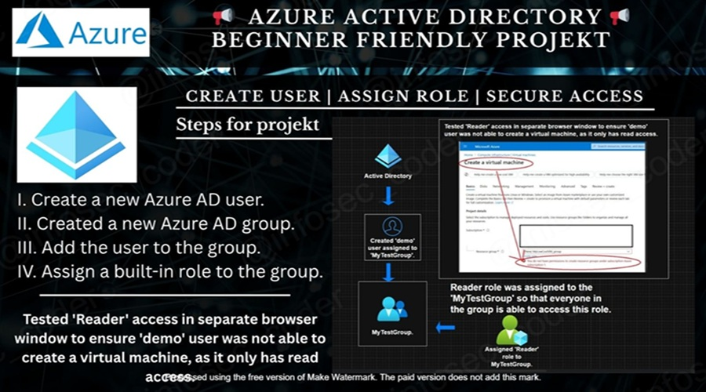

# 📢 Azure AD: Role-Based Access Control (RBAC) Test  
🛡️ *Manage Access Securely Using Azure Active Directory Groups and Roles*

## 📌 Project Description  
This mini-project demonstrates how to **securely assign role-based access** using **Azure Active Directory (Azure AD)** by creating a **test user**, placing them into a **group**, and then assigning a **built-in role** (`Reader`) to that group. It includes a verification step to ensure the user can **only view but not modify** resources — following the principle of **least privilege**.

---

## 🏗️ The architecture performs the following actions:

- 👤   &nbsp;&nbsp;**Creates a test user** (`demo`) in Azure AD  
- 👥   &nbsp;&nbsp;**Creates a group** (`MyTestGroup`) for centralized access control  
- ➕   &nbsp;&nbsp;**Adds the test user to the group** to inherit permissions  
- 🔐   &nbsp;&nbsp;**Assigns the built-in `Reader` role** to the group  
- 🧪   &nbsp;&nbsp;**Tests user access** in a new browser window or incognito session  
- 🚫   &nbsp;&nbsp;**Validates restricted access** — user can **view resources** but **not create/delete/modify**  
- 🧹   &nbsp;&nbsp;**Cleans up** by deleting the test user and group (optional)

---

## ✅ Key Learnings

| 🔍 Topic               | 💡 Takeaway                                                                 |
|-------------------------|-----------------------------------------------------------------------------|
| **Azure RBAC**          | Roles can be assigned to groups, not just individuals, for scalable access. |
| **Reader Role**         | Grants **read-only access** across Azure resources.                         |
| **Group Management**    | Centralized group control simplifies permission changes.                    |
| **Testing Permissions** | Always verify access by logging in as the test user.                        |

---

  

## ✅ Project Goals 
- 👤   &nbsp;&nbsp;Create a **test user** in Azure Active Directory. 
- 👥   &nbsp;&nbsp;Create a **group** to manage role-based permissions centrally. 
- ➕   &nbsp;&nbsp;Assign the user to the group to inherit group permissions. 
- 🔐   &nbsp;&nbsp;Assign the built-in **Reader** role to the group. 
- 🧪   &nbsp;&nbsp;Verify that the test user can only **view** resources, not modify. 

---

## 🔧 What I Accomplished

👤   Created a Test User in Azure AD 
&nbsp;&nbsp;&nbsp;&nbsp;&nbsp;Provisioned a user (`demo`) to simulate real-world RBAC scenarios.

👥   Created an Azure AD Group 
&nbsp;&nbsp;&nbsp;&nbsp;&nbsp;Configured `MyTestGroup` to manage permissions as a single unit.

➕   Added the User to the Group 
&nbsp;&nbsp;&nbsp;&nbsp;&nbsp;Ensured that the test user inherits all group-assigned roles.

🔐   Assigned Reader Role to the Group 
&nbsp;&nbsp;&nbsp;&nbsp;&nbsp;Used Azure’s built-in `Reader` role to allow read-only access across resources.

🧪   Validated RBAC with Test Login 
&nbsp;&nbsp;&nbsp;&nbsp;&nbsp;Opened a new browser session to simulate the test user’s experience and confirm they could not alter resources.

---

## 💡   Key Learnings & Outcomes
-  🧠   &nbsp;&nbsp;Learned to configure **role-based access** at group level for scalability  
-  🛡️   &nbsp;&nbsp;Understood **least privilege** and the use of **built-in roles** like `Reader`  
-  🔍   &nbsp;&nbsp;Practiced verifying access using separate sessions for realistic user simulation  
-  🏗️   &nbsp;&nbsp;Recognized how **Azure AD Groups** streamline access control in enterprise settings  
-  🧹   &nbsp;&nbsp;Discovered the importance of **cleanup** to avoid cluttering the directory  

