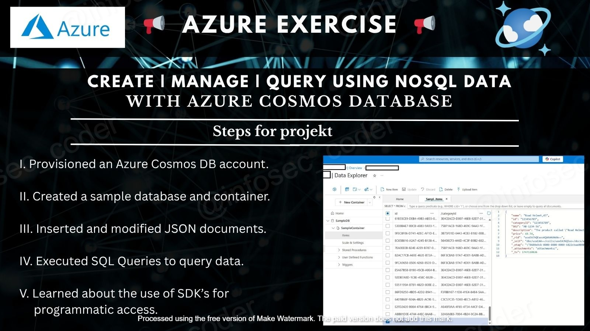

<h1>Azure Cosmos DB mini-projekt  🌌 </h1>
This PoC demonstrates how to provision, manage, and query NoSQL data using Azure Cosmos DB through the Azure portal.
 
  An Azure Cosmos DB account was created and configured with provisioned throughput. A sample database and 
 container were deployed, where JSON documents were inserted and modified. SQL queries were then executed in Data 
 Explorer to retrieve data, followed by reviewing how developers typically use SDKs for programmatic access in 
 production environment 
 
 <h2>Example use case:</h2>
A development team needs a fast and scalable NoSQL database to prototype a catalog of product data. Azure Cosmos DB 
 allows them to quickly ingest, view, and query JSON documents with flexible schema support, using tools built 
 into the Azure portal and SDKs for integration with applications.
 
 

