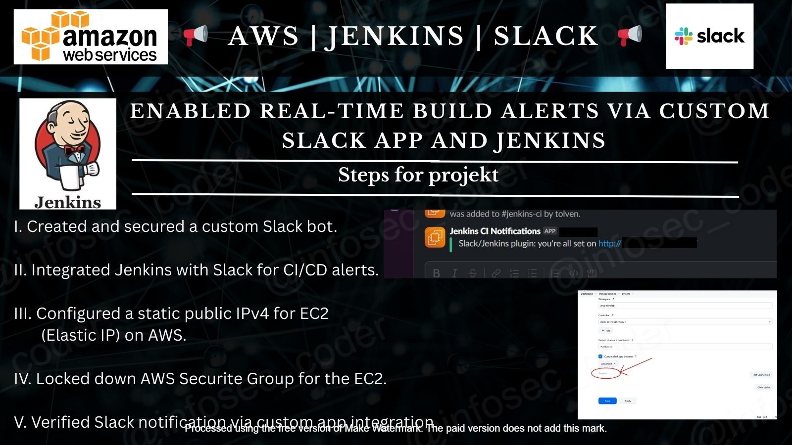

## 🚀 **Jenkins x Slack: CI/CD Notification Integration Project**

### 🤖 *Automating Real-Time Build Notifications in a Secure, Dynamic Network Environment*

### 📌 **Project Description**

This project involved designing and deploying a secure and resilient integration between **Jenkins** (hosted on an AWS EC2 instance) and **Slack**, with the goal of sending automated build notifications directly to a designated Slack channel. It required the configuration of custom Slack apps, secure API tokens, Elastic IP management, security group hardening, and dynamic troubleshooting in a VPN-driven workflow.

---

### ✅ **Project Goals**

* 📬 Automate Jenkins build result notifications to a Slack channel
* 🛡️ Securely manage dynamic VPN IPs using Elastic IP
* 🔒 Harden EC2 access while maintaining Jenkins usability
* 🤝 Authenticate Jenkins to Slack with OAuth tokens and bot integration
* ⚙️ Validate and test integrations in a changing network context

---

### 🔧 **What I Accomplished**

* 🧠 **Created a Custom Slack App with Bot Integration**
  Built and configured a Slack app with the appropriate OAuth scopes and bot capabilities to allow Jenkins communication.

* 🔐 **Stored Bot OAuth Token Securely in Jenkins**
  Used Jenkins’ “Secret Text” credential type to store the bot token securely, avoiding hardcoded secrets in builds.

* 🔗 **Integrated Jenkins with Slack using Slack Notification Plugin**
  Enabled Slack communication by configuring the workspace, channel, and credentials directly in Jenkins' global system config.

* 📡 **Allocated & Associated an Elastic IP to the EC2 Instance**
  Addressed VPN-related IP shifts by assigning a fixed Elastic IP to the Jenkins EC2 instance, ensuring stable remote access and webhook integrity.

* 🔒 **Updated Security Groups and Enabled Jenkins Port (8080)**
  Managed inbound rules dynamically to support changing VPN IPs, and finally secured access by allowing port 8080 from `0.0.0.0/0` during testing.

* 🧪 **Tested Slack-Jenkins Connection and Verified Notification Delivery**
  Confirmed successful connection after troubleshooting missing bot credentials, uninvited bot issues, and security misconfigurations.

---

### 💡 **Key Learnings & Outcomes**

* 📚 Gained deep experience in **Slack API configuration**, OAuth token scopes, and Slack bot management.
* ⚙️ Learned to troubleshoot Jenkins plugin integration errors related to missing credentials, token formatting, and workspace/channel naming.
* 🌐 Navigated dynamic **VPN-related IP changes** and implemented a static IP strategy for cloud-hosted services.
* 🧱 Strengthened understanding of **EC2 network security** and Jenkins deployment in AWS infrastructure.
* 📲 Delivered a real-time notification system to enhance visibility and feedback in a CI/CD pipeline environment.

---

Let me know if you'd like this adapted into a portfolio layout, PDF format, GitHub `README.md`, or something short and punchy for LinkedIn posts.

