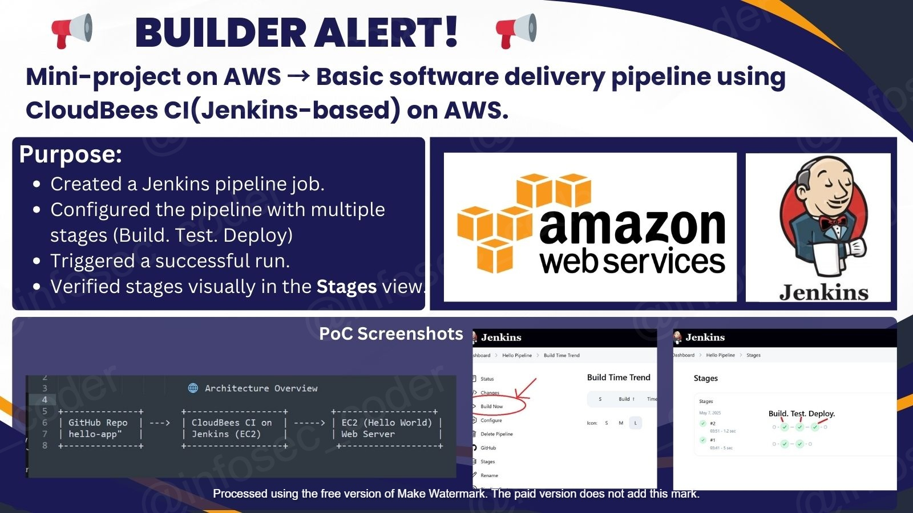
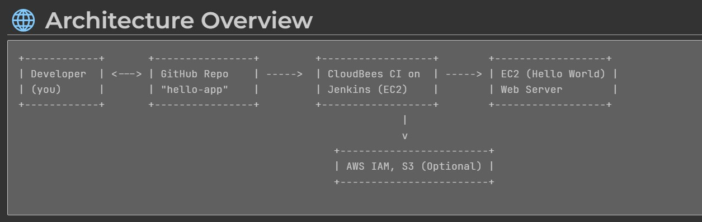

<h1>🐝 CloudBees Mini-Project:
 Continuous Integration with AWS EC2 and CloudBees CI</h1>
 
CloudBees CI ensures a streamlined **CI/CD pipeline** for automating deployments, making it easier to manage 
 application code changes and updates in an efficient and reliable manner.
 
## CloudBees Mini-Project: Continuous Integration with AWS EC2 and CloudBees CI

This mini-project demonstrates the integration of **CloudBees CI** (Jenkins-based) with **AWS EC2** and **GitHub** to automate the deployment of a simple **Hello World** web application on an EC2 instance. The pipeline facilitates seamless code integration and deployment, with optional Docker support.

cloudbees_jenkins_lc_WATERMARKED_lc.jpg

### Overview:
- **GitHub** hosts the application code in the **"hello-app" repository**.
- **CloudBees CI** (Jenkins-based) is used to automate the build, test, and deployment processes.
- The application is deployed to an **EC2 instance** running Ubuntu, serving a basic **Hello World** web server.
- **Docker** can be optionally used to containerize the application for deployment.

### Use Case:
- A developer pushes code changes to **GitHub**.
- **CloudBees CI** automatically triggers the build and deployment pipeline, ensuring that the **Hello World** application is correctly deployed to the EC2 instance.
- Optional: **Docker** can be used to package the application into a container, which is then deployed on EC2, ensuring portability and scalability.

CloudBees CI ensures a streamlined **CI/CD pipeline** for automating deployments, making it easier to manage application code changes and updates in an efficient and reliable manner.

### 🛠️ Tools Used:
- **AWS EC2 (Ubuntu)** – Cloud server to deploy and run the web application.
- **CloudBees CI** – Jenkins-based platform for automating build, test, and deployment workflows.
- **GitHub** – Source control platform for managing the application code.

