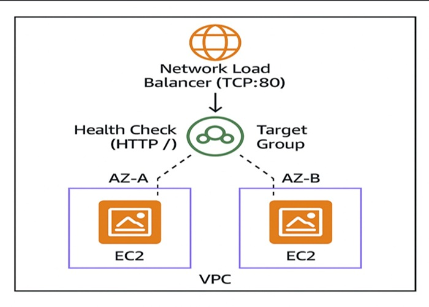

# 📢 NLB x EC2: TCP Load Balancing Across AZs Project  
🌐 *Distribute Traffic Seamlessly Using AWS Network Load Balancer and EC2 Instances*

---

## 📌 Project Description  
This mini-project showcases how to set up a **Network Load Balancer (NLB)** that distributes **TCP traffic** across **two EC2 instances** located in different **Availability Zones (AZs)** within the **same VPC and Region**. It's designed to be lightweight and beginner-friendly while demonstrating core AWS networking concepts like **layer 4 load balancing**, **target groups**, and **cross-AZ high availability**.
 
<h3>The architecture performs the following actions:</h3>
- 🔗   &nbsp;&nbsp;Listens for incoming TCP traffic on port 80  
 - 📍   &nbsp;&nbsp;Distributes connections to EC2 instances in multiple AZs  
 - 📈   &nbsp;&nbsp;Monitors instance health via HTTP path-based health checks  
 - 📤   &nbsp;&nbsp;Ensures high availability through cross-AZ load balancing  
 - 🔒   &nbsp;&nbsp;Applies Security Groups to permit HTTP access from the internet  
 - 🧾   &nbsp;&nbsp;**Logs health checks and connection attempts for visibility and debugging**

This project is a great introduction to **high-availability network architectures** and **layer 4 load balancing** using AWS-native services.

---
