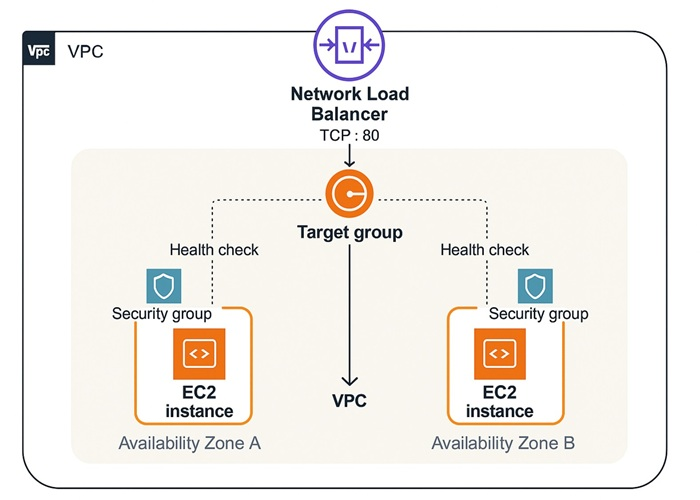

# 📢 NLB x EC2: TCP Load Balancing Across AZs Project  
🌐 *Distribute Traffic Seamlessly Using AWS Network Load Balancer and EC2 Instances*

---

## 📌 Project Description  
This mini-project showcases how to set up a **Network Load Balancer (NLB)** that distributes **TCP traffic** across **two EC2 instances** located in different **Availability Zones (AZs)** within the **same VPC and Region**. It's designed to be lightweight and beginner-friendly while demonstrating core AWS networking concepts like **layer 4 load balancing**, **target groups**, and **cross-AZ high availability**.
 
## The architecture performs the following actions:
- 🔗   &nbsp;&nbsp;Listens for incoming TCP traffic on port 80  
- 📍   &nbsp;&nbsp;Distributes connections to EC2 instances in multiple AZs  
- 📈   &nbsp;&nbsp;Monitors instance health via HTTP path-based health checks  
- 📤   &nbsp;&nbsp;Ensures high availability through cross-AZ load balancing  
- 🔒   &nbsp;&nbsp;Applies Security Groups to permit HTTP access from the internet  
- 🧾   &nbsp;&nbsp;**Logs health checks and connection attempts for visibility and debugging**  

---

## ✅ Project Goals 
- 🌐   &nbsp;&nbsp;Deploy a Network Load Balancer (NLB) to manage TCP traffic across EC2 instances. 
- 🛡️   &nbsp;&nbsp;Ensure high availability by distributing traffic across two Availability Zones. 
- 🎯   &nbsp;&nbsp;Register EC2 instances as targets in a Target Group for the NLB. 
- 🔒   &nbsp;&nbsp;Configure and attach security groups to control inbound/outbound traffic. 
- 📶   &nbsp;&nbsp;Verify connectivity and load balancing across AZs using public IP. 

---

## 🔧 What I Accomplished
🏗️   Created a Network Load Balancer 
&nbsp;&nbsp;&nbsp;&nbsp;&nbsp;Launched an NLB in the same VPC and Availability Zones as the EC2 instances to handle TCP-based load distribution.

🖥️   Deployed Two EC2 Instances 
&nbsp;&nbsp;&nbsp;&nbsp;&nbsp;Provisioned two Amazon Linux 2 EC2 instances in separate subnets across different AZs and installed simple web servers.

🗂️   Registered EC2s in a Target Group 
 &nbsp;&nbsp;&nbsp;&nbsp;&nbsp;Configured a TCP-based Target Group and added both EC2 instances, enabling cross-zone load balancing.

🔐   Applied Security Group Settings 
&nbsp;&nbsp;&nbsp;&nbsp;&nbsp;Ensured security groups allowed TCP traffic on the NLB’s listening port (e.g., port 80) and that EC2 instances accepted traffic from the NLB.

🔍   Validated Load Balancing Behavior 
&nbsp;&nbsp;&nbsp;&nbsp;&nbsp;Used browser-based and CLI tests to verify round-robin traffic distribution and ensure resilience during EC2 failure scenarios.

---

## 💡   Key Learnings & Outcomes
-  ⚙️   &nbsp;&nbsp;Gained practical experience in deploying and configuring AWS Network Load Balancer
-  🧩   &nbsp;&nbsp;Understood the role of Target Groups in connecting load balancers to backend resources
-  🔐   &nbsp;&nbsp;Strengthened knowledge of security groups, TCP traffic flow, and AWS network architecture
-  🗺️   &nbsp;&nbsp;Learned how to design and test high availability by spanning multiple AZs
-  📈   &nbsp;&nbsp;Increased confidence in troubleshooting load balancing behavior using EC2 instance logs and connectivity tests

