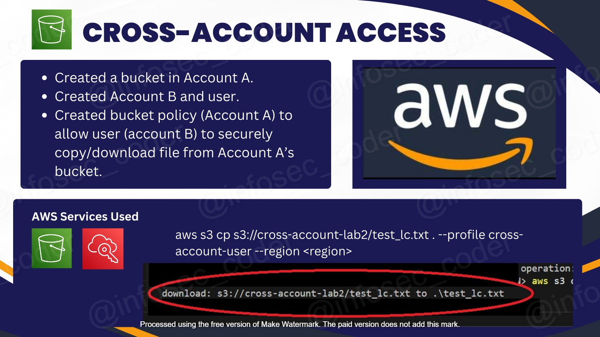

<h1>S3 cross account access mini-projekt</h1>
  This PoC demonstrates secure cross-account access between two AWS accounts using an S3 bucket policy. 
  Account A hosts a bucket and grants explicit access to a user in Account B, permitting user B
 to download files to an S3 bucket in Account B. An IAM role was created in Account A to allow
 access to the files in Account A's S3 bucket. 
 
 <h2>Example use case:</h2>
 A team from Account B requires read-only access to compliance logs stored in Account A's S3 bucket for 
 auditing purposes, using the principle of least privilege (PLP) to meet the business need for this use case.
 

