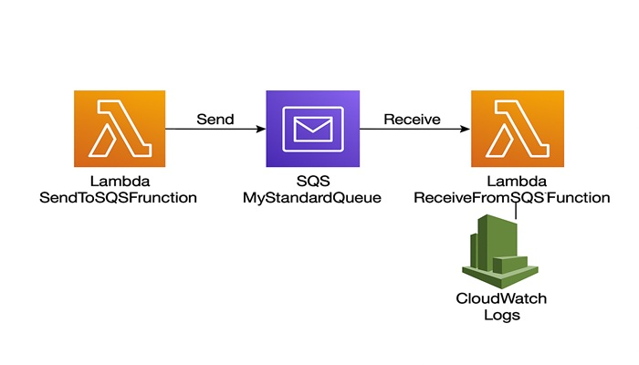

# 📦 SQS x Lambda: Bi-Directional Message Exchange Project

---

🔁 Send and Receive Messages Seamlessly Using AWS SQS and Lambda

### 📌 Project Description

This mini-project demonstrates a foundational event-driven workflow by enabling an AWS Lambda function to both **send messages to** and **receive messages from** an Amazon Simple Queue Service (SQS) queue. It showcases a **bi-directional communication pattern**, commonly used in decoupled microservice architectures.

The Lambda function is triggered manually (or by another service) and performs the following actions:
 - 📬 &nbsp;&nbsp;Send an email when an event occurs
 - ✅ &nbsp;&nbsp;**Sends a message** to the SQS queue.
 - 📥 &nbsp;&nbsp;**Receives messages** from the queue.
 - 🗑️ &nbsp;&nbsp;**Deletes the messages** after processing.
 - 🧾 &nbsp;&nbsp;**Logs key events such as sending, receiving, and deleting for full traceability.
 

---

##  ✅ Project Goals

 - 📨 &nbsp;&nbsp;Send a message to an SQS queue from a Lambda function
-  📥 &nbsp;&nbsp;Retrieve and process messages from the same SQS queue
-  🟨 &nbsp;&nbsp;Use AWS Lambda as both producer and consumer in the messaging pipeline
-  🧼 &nbsp;&nbsp;Automatically delete messages from the queue after processing
-  🪵 &nbsp;&nbsp;Log all send/receive/delete actions in CloudWatch for observability

---

## 🔧 What I Accomplished

- 📦 &nbsp;&nbsp;Created an Amazon SQS Queue 
      Set up a standard SQS queue with appropriate access policies to allow message sending and receiving.
- 🧑‍💻 &nbsp;&nbsp;Wrote and deployed a dual-purpose Lambda Function. 
      Developed a Python-based Lambda function that sends a message to the queue, receives a message,  
      and deletes it—executing the full SQS workflow.
- 🔐 &nbsp;&nbsp;Configured Environment Variables and IAM Permissions 
      Used the SQS_QUEUE_URL environment variable for queue targeting and attached precise IAM policies  
       to grant SendMessage, ReceiveMessage, and DeleteMessage permissions.
- 🧪 &nbsp;&nbsp;Manually Triggered the Lambda Function 
      Used the Lambda Console's "Test" feature to simulate an event, verify end-to-end message delivery,  
      and observe logs in CloudWatch.
- 📄 &nbsp;&nbsp;Logged Message Lifecycle Events 
      Printed out sent message IDs, received message bodies, and confirmation of deletion steps for full  
      operational visibility.
    
  --- 
    
💡 Key Learnings & Outcomes

- 🔁 &nbsp;&nbsp;Learned how Lambda can act as both a producer and consumer in an SQS-backed workflow
- 🔑 &nbsp;&nbsp;Gained hands-on experience with IAM policies for SQS operations
- 🪝 &nbsp;&nbsp;Improved understanding of decoupled, event-driven architectures and async communication
- 🛠️ &nbsp;&nbsp;Practiced structuring Python code for message lifecycle management (send → receive → delete)
- 📊 &nbsp;&nbsp;Strengthened ability to troubleshoot using CloudWatch Logs and confirm functional behavior step-by-step

